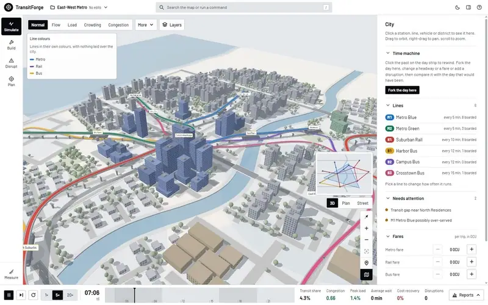
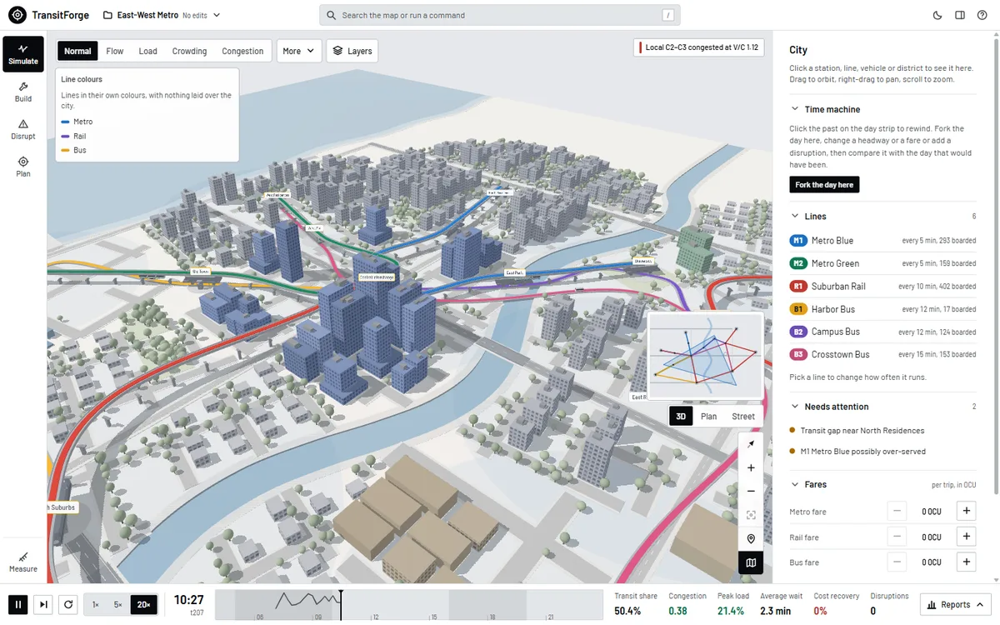
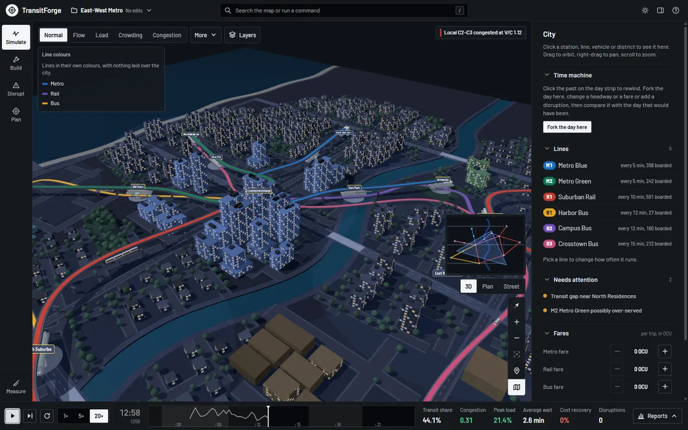
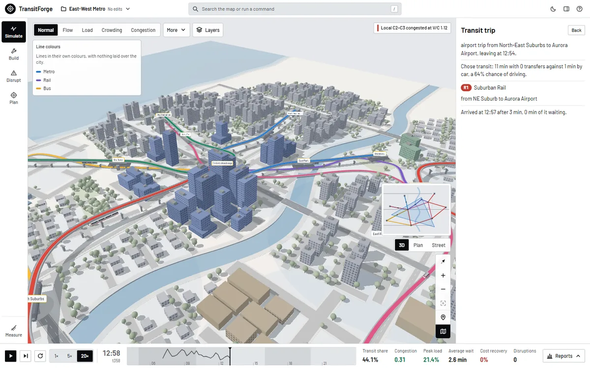
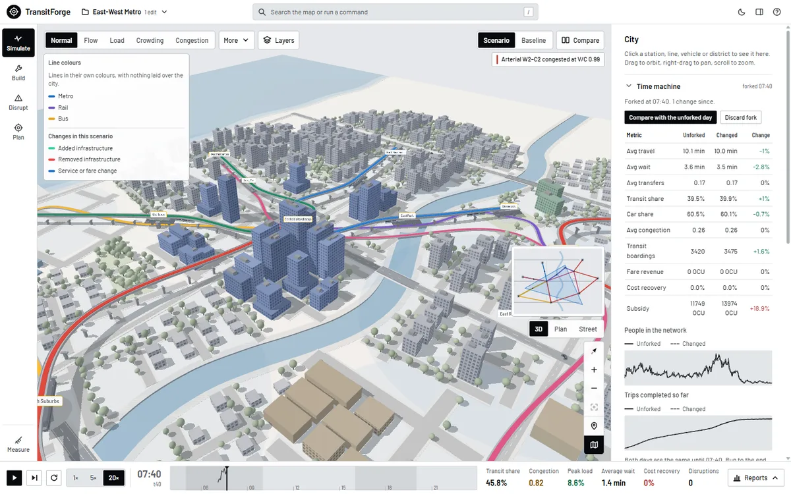
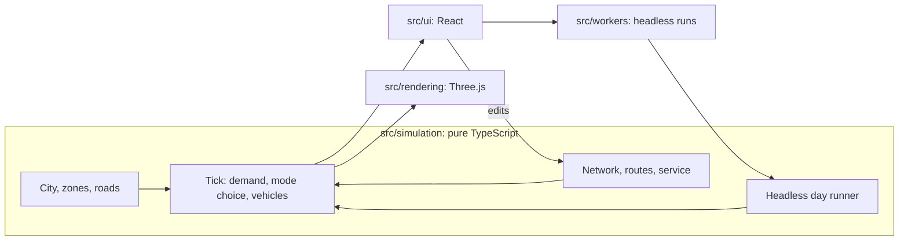

# TransitForge

[](https://github.com/abivan100-stack/transit-forge/actions/workflows/ci.yml)

A browser-based 3D public transportation planning and simulation sandbox. Build
metro, rail and bus lines, run a simulated day, break the network and plan
against objectives. TypeScript, React, Vite and Three.js, with no game engine.



<table>
  <tr>
    <td></td>
    <td></td>
  </tr>
  <tr>
    <td align="center">Light</td>
    <td align="center">Dark</td>
  </tr>
</table>

## What it is

A city of districts, roads and lines. People choose between transit and the car,
wait on platforms, board, transfer, get stranded or give up, and every number on
screen traces back to that simulation state. Four modes cover the work:

- **Simulate** runs the day at 1×, 5× or 20× and shows lines, loads and readings.
- **Build** edits the network: stations, routes and roads.
- **Disrupt** schedules and ends incidents, from a station closure to a road
  closure, and shows rerouting and recovery.
- **Plan** sets a brief with objectives and constraints and scores your changes
  against it.

## Try it

```sh
npm install
npm run dev
```

Press `?` in the app for the full list of keys. The ones you will use first:

| Key | Action |
| --- | --- |
| `Space` | play or pause |
| `1` `2` `3` | speed 1× / 5× / 20× |
| `B` `D` `P` | build, disrupt, plan |
| `Esc` | back to simulate |
| `/` | search the map or run a command |
| `T` | switch between light and dark |
| `[` `]` | hide or show the side panel |

## Two things worth a look

### Why did this trip happen?

Select a vehicle to see its riders, a station to see who is waiting, or open
Recent trips. A trip card explains the trip in plain statements: the options the
person had, the transit and road estimates, the fare and the chance they would
drive, where they waited and how it ended. Stranded and denied-boarding trips are
marked, since they are the most useful to read.



### Time machine

Click the past on the day strip and the day is rebuilt from 07:00. "Fork the day
here" freezes what you have done so far. Change a headway or a fare, or add a
disruption, then compare the changed day against the day that would have been.
Both run headless with the same seed, so the two are identical until the minute
of the fork.



## How it is built

Three layers, kept apart (`AGENTS.md`):



- `src/simulation/` has no React or Three.js imports. City data, routing
  (Dijkstra and A*), ticks, loads and statistics live here.
- `src/rendering/` draws simulation state and holds no simulation logic.
- `src/ui/` is the dashboard, controls and inspectors, and only calls the
  simulation API.
- `src/workers/` runs whole days headless for the fork comparison.

Interface rules are in [`DESIGN.md`](DESIGN.md): colour only ever means a line or
a condition, and selection is ink. Light and dark ship as one design.

## Determinism

The simulation is deterministic: seed `1337`, no `Math.random()` in
`src/simulation/`, and a golden test that pins the statistics of a day. A change
that alters results has to be able to explain why. That is what lets the time
machine rebuild any minute by replay.

## Decisions worth reading

- [`docs/engineering.md`](docs/engineering.md): the three decisions in one page.
- [`docs/adr/0001`](docs/adr/0001-vehicles-follow-a-display-schedule.md): vehicles
  are drawn on a display schedule, not at their step positions.
- [`docs/adr/0002`](docs/adr/0002-a-tick-is-a-time-budget.md): a tick is a time
  budget, and every stop pays its own dwell.
- [`DESIGN.md`](DESIGN.md): the design system.

## Run and test

```sh
npm install
npm run dev      # development server
npm run lint     # oxlint
npm run test     # vitest: determinism, routing, replay, the golden day
npm run build    # type-check and production build
```

Node 22.12 or newer. CI runs lint, test and build on every push to `main` and on
every pull request. Release notes are in [`CHANGELOG.md`](CHANGELOG.md).

## Known limitations

- World geography is compact (about 1.2 km across), so absolute travel times read
  low: a few minutes cross-city. A world-scale pass should precede any
  fare or economics work.
- Vehicles are drawn on each line's display schedule rather than at their
  simulation positions, because the map is compact (`docs/adr/0001`). The
  simulation itself spends each tick as a time budget per vehicle: it stops at
  every station and pays that stop's dwell (`docs/adr/0002`).
- A fork changes service, fares and disruptions. Structural edits (stations,
  routes, roads) apply to the whole day and are made in Build mode.

## Licence

Apache License 2.0. See [`LICENSE`](LICENSE).

## Credits

Built on [Raghav2012Code/transit-forge](https://github.com/Raghav2012Code/transit-forge),
the parent repository, by Raghav Krishna and Abivan.

## Principle

A metro line must exist in the simulation model. Stations have demand. Routes
affect travel times. Network edits must be capable of changing simulation
results.
