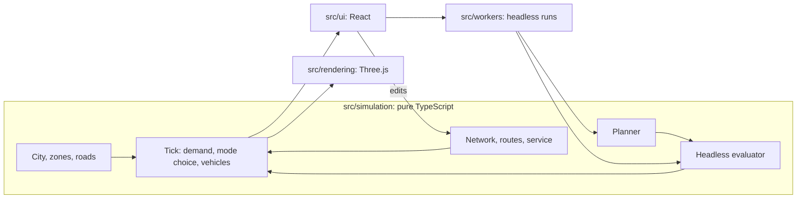

# Showcase release: implementation plan

Spec: [`docs/superpowers/specs/2026-10-07-showcase-release-design.md`](../specs/2026-10-07-showcase-release-design.md).
Read the spec first. This plan says how, in order, with the checks that prove each step.

**Goal.** Make TransitForge a portfolio piece that is live, honest and finished, and add three features built on the
simulation's determinism: a journey inspector, a time machine and Beat the Planner.

**Shape.** Eight milestones, one commit each, each on its own branch and merged through a pull request into the
fork's `main`. Milestones 1 to 4 ship the release. 5 to 7 are features. 8 is the front page.

**Stack facts the steps rely on.** TypeScript 6, React 19, Vite 8, Vitest 5, oxlint, Three.js 0.182. Vitest runs in the
default `node` environment, so there is no DOM in unit tests: logic that needs a test is pure and takes its inputs as
arguments. Imports in `src/` use explicit `.ts` and `.tsx` extensions.

---

## Conventions for every milestone

**Branch and commit.**

```sh
git checkout main && git pull origin main
git checkout -b feature/<slug>
# ...work...
npm run lint && npm run test && npm run build      # must all be clean
git add -A && git commit -m "<Imperative sentence, no prefix>"
```

The history uses plain imperative messages ("Make vehicles stop at stations, ..."), so do the same. A milestone is one
commit. If working commits piled up, squash them with `git reset --soft $(git merge-base HEAD main)` and commit again
(`git rebase -i` is unavailable here).

**Land it.**

```sh
git push -u origin feature/<slug>
gh pr create --repo abivan100-stack/transit-forge --base main --head feature/<slug> --title "<same as commit>" --body "<what and how it was checked>"
```

Always pass `--repo abivan100-stack/transit-forge`: the repo's default for `gh` is the parent (`Raghav2012Code`).
**Stop and ask the owner before `gh pr merge`.** Merging into the fork's `main` also updates the open parent PR
(Raghav2012Code/transit-forge#4, whose head is the fork's `main`). Ask once per milestone; an earlier yes does not
cover the next one unless the owner says it does. After approval:
`gh pr merge <n> --repo abivan100-stack/transit-forge --merge` (merge commits, as in the history).

**Rules from `AGENTS.md` that apply to every step.**

- No `Math.random()` in `src/simulation/`. A change that alters simulation results must say why. Milestones 5 to 7 are required to leave results unchanged and prove it with the golden test (milestone 5, task 5.1).
- Extend a type; never weaken it to `any`.
- No analytics per passenger or per frame. Compute per tick-band or on demand.
- Simulation code stays free of React and Three.js imports. Rendering holds no sim logic. UI components call the simulation API and hold no sim logic.
- A new keyboard shortcut goes in both `onKey` in `src/App.tsx` and `src/ui/shell/shortcuts.ts`. Every action that can be done is also a command in `buildCommands`.
- UI: read `DESIGN.md` first. Colour means a line or a condition; selection is ink. Components read tokens from `src/index.css` and stay theme-blind. Check light and dark (`T`) and 390 px before the commit.

**UI check (used by every milestone that touches the interface).** With `npm run dev` running, use the Playwright MCP
tools: resize to 1440×900, 768×1024 and 390×844; in each, screenshot light and dark (press `T`); read the console
(`browser_console_messages`) and expect no errors; confirm no horizontal scroll with
`document.documentElement.scrollWidth <= document.documentElement.clientWidth`.

**Windows shell.** The Bash tool is Git Bash (`&&` works). PowerShell 5.1 has no `&&`.

---

## Preflight (once, before milestone 1)

- [ ] `git status` is clean on `feature/sim-correctness`; the spec commits are the only ahead-of-origin commits.
- [ ] `node --version` is 22.12 or newer (Vite 8 requires it). It is 24.x here.
- [ ] `gh auth status` shows the `abivan100-stack` account with `repo` and `workflow` scopes. If `workflow` is missing (it is needed to push `.github/workflows/`): `gh auth refresh -s workflow` (the owner runs it with `! gh auth refresh -s workflow`, as it opens a browser).
- [ ] `npm run lint && npm run test && npm run build` are clean on the starting commit. Write down the test count; it is only for the PR description, not the README.

---

## Milestone 1. Land the branch and make the README true

**Branch:** `feature/sim-correctness` (already exists).

### Task 1.1 Correct the README against the code

**Files:** `README.md`.

- [ ] Read `docs/adr/0001-vehicles-follow-a-display-schedule.md`, `docs/adr/0002-a-tick-is-a-time-budget.md` and `src/version.ts`.
- [ ] Find the stale lines: `grep -n "tests passing\|Known limitations\|drawn on each line" README.md`.
- [ ] In the **Status** section, delete every `NN tests passing` phrase (the numbers are stale and the README will not hard-code a count). Leave the rest of the version history; milestone 8 moves it to `CHANGELOG.md`.
- [ ] Add one line at the top of **Status**: `Current version: 1.3.0 (see src/version.ts).` Write the version by reading `src/version.ts`, not from memory.
- [ ] Rewrite **Known limitations** so each bullet is true now. Keep the compact-geography bullet (the scale pass is still out of scope). Replace the vehicles bullet using ADR 0001 and 0002: vehicles are drawn on each line's display schedule, while the simulation moves them with a per-tick time budget, stopping at every station with its dwell. Rename the heading from "(v0.4 candidates)" to "Known limitations".
- [ ] `git diff README.md` and confirm no sentence contradicts the ADRs.

### Task 1.2 Verify, commit, open the PR

- [ ] `npm run lint && npm run test && npm run build` clean.
- [ ] `git add README.md && git commit -m "Correct the README status and known limitations"`
- [ ] `git push origin feature/sim-correctness`
- [ ] `gh pr create --repo abivan100-stack/transit-forge --base main --head feature/sim-correctness --title "Correct simulation behaviour, placement rules and bundle size" --body "<summary of 5185cc4, the spec commits, the README fix; test count; checks run>"`
- [ ] **Ask the owner for approval to merge** and tell them it will also appear in the open parent PR #4. After a yes: `gh pr merge <n> --repo abivan100-stack/transit-forge --merge`.
- [ ] `git checkout main && git pull origin main`.

**Accepted when:** fork `main` contains the correctness work and the README has no stale number or contradicting limitation.

---

## Milestone 2. CI and a live deployment

**Branch:** `feature/ci-deploy`.

### Task 2.1 CI workflow

**Files:** create `.github/workflows/ci.yml`; edit `package.json`.

- [ ] Create `.github/workflows/ci.yml`:

```yaml
name: CI

on:
  push:
    branches: [main]
  pull_request:

concurrency:
  group: ci-${{ github.ref }}
  cancel-in-progress: true

jobs:
  check:
    runs-on: ubuntu-latest
    steps:
      - uses: actions/checkout@v4
      - uses: actions/setup-node@v4
        with:
          node-version: 22
          cache: npm
      - run: npm ci
      - run: npm run lint
      - run: npm run test
      - run: npm run build
```

- [ ] In `package.json` add `"engines": { "node": ">=22.12" }` after `"type": "module"`. (Vercel reads it, and it documents the Vite 8 requirement.)
- [ ] `npm install --package-lock-only` and confirm `package-lock.json` changes only if needed.
- [ ] Push the branch and open the PR. Watch the run: `gh run watch --repo abivan100-stack/transit-forge`.
- [ ] If the Linux run fails where Windows passed, the usual causes are import path case (`./Foo.tsx` against `foo.tsx`), line endings and timing. Fix the cause in code; do not weaken the workflow.

### Task 2.2 Deploy

Vercel serves the static build. No server code, base path `/`, so `vite.config.ts` does not change and no `vercel.json` is needed
(Vercel detects Vite; build `npm run build`, output `dist`).

- [ ] Ask the owner which route they want: (a) they import the repo in the Vercel dashboard (New Project, pick `abivan100-stack/transit-forge`, framework Vite, production branch `main`), or (b) authenticate the Vercel connector here (`ToolSearch` for `mcp__vercel__authenticate`, owner completes sign-in) and create the project through it.
- [ ] After the first deploy, record the production URL. It is needed by milestones 4 and 8.
- [ ] Verify cold: `curl -sI <url>` returns `200`; then with the Playwright MCP open the URL in a fresh context, wait for the canvas, and read the console. Expect zero errors.
- [ ] Verify Vercel builds the PR: the PR shows a preview deployment.

### Task 2.3 Merge

- [ ] Commit `Add CI and deploy the app` (workflow, `package.json`, lockfile if changed). Ask the owner, then merge. Confirm the production URL serves the new `main` commit.

**Accepted when:** a push to `main` builds in CI and the live URL serves that commit, loaded cold.
**Gate:** needs the owner's Vercel account (or connector sign-in). If it is unavailable, finish 2.1 and carry on; 2.2 stays open and milestone 8's live link waits on it.

---

## Milestone 3. Failure handling

**Branch:** `feature/failure-handling`. No tour and no onboarding UI (the existing "First run" checklist stays).

### Task 3.1 Pure logic with tests

**Files:** create `src/ui/shell/failure.ts`, `src/ui/shell/failure.test.ts`.

All app storage keys start with `transitforge.` (`theme`, `layers.v1`, `minimap`, `plans.v1`, `scenarios.v1`, `tutorial.v1`), so one prefix clears them.

- [ ] Create `src/ui/shell/failure.ts`:

```ts
// What the fallback screen says, and how it clears saved data. Pure: storage is passed in.
export type FailureKind = 'webgl' | 'crash';

export interface Failure {
  kind: FailureKind;
  title: string;
  detail: string;
}

const PREFIX = 'transitforge.';

export function describeFailure(error: unknown): Failure {
  const message = error instanceof Error ? error.message : String(error);
  if (/webgl/i.test(message)) {
    return {
      kind: 'webgl',
      title: 'This browser cannot draw the 3D map',
      detail: 'TransitForge needs WebGL. Turn on hardware acceleration, or try a current Chrome, Edge, Firefox or Safari.',
    };
  }
  return { kind: 'crash', title: 'Something went wrong', detail: message };
}

/** Remove every key this app wrote. Returns how many were removed. */
export function clearSavedData(storage: Pick<Storage, 'length' | 'key' | 'removeItem'>): number {
  const keys: string[] = [];
  for (let i = 0; i < storage.length; i++) {
    const key = storage.key(i);
    if (key && key.startsWith(PREFIX)) keys.push(key);
  }
  for (const key of keys) storage.removeItem(key);
  return keys.length;
}
```

- [ ] Create `src/ui/shell/failure.test.ts` (write it first and watch it fail before `failure.ts` exists):

```ts
import { describe, expect, it } from 'vitest';
import { clearSavedData, describeFailure } from './failure.ts';

function fakeStorage(entries: Record<string, string>) {
  const data = new Map(Object.entries(entries));
  return {
    get length() { return data.size; },
    key: (i: number) => [...data.keys()][i] ?? null,
    removeItem: (k: string) => { data.delete(k); },
    keys: () => [...data.keys()],
  };
}

describe('describeFailure', () => {
  it('names a WebGL failure in words', () => {
    const f = describeFailure(new Error('Error creating WebGL context.'));
    expect(f.kind).toBe('webgl');
    expect(f.title).toMatch(/cannot draw/i);
  });
  it('passes any other error through as a crash', () => {
    const f = describeFailure(new Error('boom'));
    expect(f).toMatchObject({ kind: 'crash', detail: 'boom' });
  });
  it('copes with a thrown string', () => {
    expect(describeFailure('plain').detail).toBe('plain');
  });
});

describe('clearSavedData', () => {
  it('removes only this app\'s keys', () => {
    const s = fakeStorage({ 'transitforge.theme': 'dark', 'transitforge.plans.v1': '{}', other: 'keep' });
    expect(clearSavedData(s)).toBe(2);
    expect(s.keys()).toEqual(['other']);
  });
  it('does nothing on empty storage', () => {
    expect(clearSavedData(fakeStorage({}))).toBe(0);
  });
});
```

- [ ] `npx vitest run src/ui/shell/failure.test.ts` passes.

### Task 3.2 Boundary and wiring

**Files:** create `src/ui/shell/ErrorBoundary.tsx`; edit `src/main.tsx`, `src/App.css`.

- [ ] Read `DESIGN.md` and the spacing tokens in `src/index.css` (lines 78 to 89, between the type and radius tokens) so the styles below use real token names.
- [ ] Create `src/ui/shell/ErrorBoundary.tsx`:

```tsx
import { Component, type ErrorInfo, type ReactNode } from 'react';
import { clearSavedData, describeFailure } from './failure.ts';

interface State {
  failed: boolean;
  error: unknown;
}

/** Last line of defence: a plain message instead of a blank page. Errors thrown in effects (such as WebGL start-up) reach it too. */
export default class ErrorBoundary extends Component<{ children: ReactNode }, State> {
  state: State = { failed: false, error: null };

  static getDerivedStateFromError(error: unknown): State {
    return { failed: true, error };
  }

  componentDidCatch(error: unknown, info: ErrorInfo) {
    console.error('TransitForge stopped', error, info.componentStack);
  }

  private reload = () => location.reload();

  private reset = () => {
    try {
      clearSavedData(localStorage);
    } catch {
      // Storage can be blocked; reloading is still worth doing.
    }
    location.reload();
  };

  render() {
    if (!this.state.failed) return this.props.children;
    const f = describeFailure(this.state.error);
    return (
      <div className="tf-fatal" role="alert">
        <h1>{f.title}</h1>
        <p>{f.detail}</p>
        <div className="tf-fatal-actions">
          <button type="button" className="tf-btn" onClick={this.reload}>Reload</button>
          {f.kind === 'crash' && (
            <button type="button" className="tf-btn" onClick={this.reset}>Reset saved data and reload</button>
          )}
        </div>
      </div>
    );
  }
}
```

- [ ] In `src/main.tsx` import it and wrap: `<StrictMode><ErrorBoundary><App /></ErrorBoundary></StrictMode>`.
- [ ] Add a `.tf-fatal` block to `src/App.css` using tokens only: centred column on `var(--paper)`, text `var(--ink)`, title at `var(--fs-head)`, detail `var(--ink-soft)`, and a visible `:focus-visible` outline on its buttons. No hard-coded colours. Check it reads in light and dark and at 390 px.
- [ ] Confirm `.tf-btn` exists in `src/App.css` (`grep -n "\.tf-btn" src/App.css`); if its styles are scoped under a shell class, restyle the fallback buttons instead of relying on it.

### Task 3.3 Verify by forcing each failure

- [ ] **WebGL off.** With the dev server up, use the Playwright MCP to add an init script before navigating that saves the original `HTMLCanvasElement.prototype.getContext` and replaces it with one that returns `null` for any type matching `/webgl/i`. Expect the "cannot draw the 3D map" message, no blank page, no "Reset saved data" button. If the message does not appear because the error is swallowed inside `SceneView`'s effect, wrap the `new THREE.WebGLRenderer(...)` call at `src/rendering/SceneView.tsx:250` so a failure rethrows into React (set state and throw during render) rather than being swallowed; do not catch it silently.
- [ ] **Render crash.** Temporarily add `throw new Error('boom')` at the top of `App`'s body, confirm the crash fallback and the reset button (set `localStorage.setItem('transitforge.theme','dark')` first and confirm the button clears it), then remove the throw. `git diff` must not contain it.
- [ ] **Corrupt saved data.** Set `transitforge.plans.v1` to `not json` and reload. If the app crashes, make the reader tolerant (`storageRead` in `src/simulation/scenario/store.ts` should already guard it); if it does not crash, record that.
- [ ] UI check (both themes, three widths).

### Task 3.4 Commit

- [ ] `npm run lint && npm run test && npm run build` clean. Commit `Show a plain message instead of a blank page when the app cannot start`. PR, ask, merge.

**Accepted when:** each forced failure shows the right message, saved data can be reset from the fallback, nothing temporary is left in the diff.

---

## Milestone 4. Quality pass (done; the automated browser suite was dropped)

**Branch:** `feature/quality-pass`.

The owner dropped the Playwright smoke test and axe suite. Software WebGL in headless Chromium ran at about 5 frames a
second here, so the suite was slow (minutes) and fragile. What was kept:

- A one-off axe scan across all four modes, both themes, at 1440 and 390 px (run by hand through Playwright, then the packages were removed). Real findings fixed: the 3D viewport `div` had an `aria-label` and no role (`role="img"` now); the page had no `<h1>` (the brand name is now the `<h1>`, kept visible on desktop and visually hidden on phones); the map legend title jumped heading levels (`h4` became `h2`). The contrast findings from the first scan were mid-transition colours: after letting the page settle, none remained.
- Browser checks stay manual with the Playwright MCP tools (the UI check procedure above).

No `playwright.config.ts`, no `e2e/` folder, no `npm run e2e`, no e2e CI job. Every later milestone's gate is
`npm run lint && npm run test && npm run build`, plus the manual UI check where the interface changed.

---

## Milestone 5. Journey inspector

**Branch:** `feature/journey-inspector`. Rule: simulation results do not change. The golden test proves it.

### Task 5.1 Golden test (first, on unmodified code)

**Files:** create `src/simulation/tests/golden.test.ts`.

- [ ] Create it with an empty expected value, run it, copy the printed value, set it, run again:

```ts
import { describe, expect, it } from 'vitest';
import { createSimulation, stepSimulation } from '../index.ts';
import { computeStats } from '../statistics.ts';

/** FNV-1a, 32 bit. Enough to notice any change in a day's results. */
function fnv1a(text: string): string {
  let h = 0x811c9dc5;
  for (let i = 0; i < text.length; i++) {
    h ^= text.charCodeAt(i);
    h = Math.imul(h, 0x01000193) >>> 0;
  }
  return h.toString(16).padStart(8, '0');
}

export function goldenOf(ticks: number): string {
  let sim = createSimulation(1337);
  for (let i = 0; i < ticks; i++) sim = stepSimulation(sim, 1);
  return fnv1a(JSON.stringify(computeStats(sim)));
}

// Recorded from the unmodified simulation. If this fails, results moved: find out why before touching the number.
const GOLDEN: Record<number, string> = { 360: '', 1020: '' };

describe('seed 1337 results are unchanged', () => {
  for (const ticks of [360, 1020]) {
    it(`after ${ticks} ticks`, () => {
      expect(goldenOf(ticks)).toBe(GOLDEN[ticks]);
    });
  }
});
```

- [ ] The first run fails and prints the received hash for each tick count. Paste them into `GOLDEN`. Run twice more to confirm it is stable.
- [ ] Also record the golden in a second process (`npx vitest run` again after a clean checkout state) to be sure no ordering of tests affects it.
- [ ] Commit this alone as the first working commit on the branch (it will be squashed into the milestone commit).

### Task 5.2 Types

**Files:** `src/types/index.ts`.

- [ ] Add after `TripPurpose`:

```ts
/** Why a trip took the mode it did. Recorded once, when the trip is created. */
export interface TripDecision {
  options: 'both' | 'transit-only' | 'road-only';
  chose: 'transit' | 'car';
  /** Minutes, including expected platform waits. Null where that option did not exist. */
  transitMin: number | null;
  transfers: number | null;
  roadMin: number | null;
  /** Fare priced into the choice (OCU). 0 when there was no choice. */
  fare: number;
  /** Probability of choosing the car. Null when the choice was forced. */
  pCar: number | null;
  /** The car was chosen but could not be created (cap reached), so the trip took transit. */
  carFailed: boolean;
}

/** A finished (or in-progress) trip, kept compactly for the inspector. */
export interface TripRecord {
  id: number;
  kind: 'transit' | 'car';
  originZone: string;
  destZone: string;
  purpose: TripPurpose;
  departMin: number;
  /** Minute the trip ended; the current minute while it is still active. */
  endMin: number;
  end: 'arrived' | 'abandoned' | 'active';
  /** Current state while active ("WAITING", "ON_VEHICLE", "DRIVING", ...). */
  state: string;
  decision: TripDecision;
  /** Empty for car trips. */
  legs: Leg[];
  waitMin: number;
  travelMin: number;
  transfers: number;
  strandedMin: number;
  farePaid: number;
}
```

- [ ] Add `decision: TripDecision;` to `Passenger` and to `CarTrip`.
- [ ] `npx tsc -b` and fix every object literal that now lacks `decision` (the compiler lists them: spawn sites and any test fixtures). Tests use a neutral decision: `{ options: 'transit-only', chose: 'transit', transitMin: 10, transfers: 0, roadMin: null, fare: 0, pCar: null, carFailed: false }`.

### Task 5.3 Recording

**Files:** create `src/simulation/passengers/tripRecord.ts`; edit `src/simulation/passengers/passengers.ts`, `src/simulation/traffic/cars.ts`, `src/simulation/index.ts`.

- [ ] Create `tripRecord.ts`:

```ts
import type { CarTrip, Passenger, TripRecord } from '../../types/index.ts';

/** The inspector remembers this many finished trips. Bounded, written once per trip. */
export const RECENT_TRIPS = 200;

export function pushTrip(ring: TripRecord[], rec: TripRecord): void {
  ring.push(rec);
  if (ring.length > RECENT_TRIPS) ring.splice(0, ring.length - RECENT_TRIPS);
}

export function recordOfPassenger(p: Passenger, nowMin: number): TripRecord {
  // A trip is abandoned only by 45 minutes stranded; replanning resets strandedMin, so this is exact.
  const end = p.state !== 'ARRIVED' ? 'active' : p.strandedMin >= 45 ? 'abandoned' : 'arrived';
  return {
    id: p.id, kind: 'transit', originZone: p.originZone, destZone: p.destZone, purpose: p.purpose,
    departMin: p.departMin, endMin: p.arriveMin ?? nowMin, end, state: p.state, decision: p.decision,
    legs: p.legs, waitMin: p.waitMin, travelMin: p.travelMin, transfers: p.transfers,
    strandedMin: p.strandedMin, farePaid: p.farePaid,
  };
}

export function recordOfCar(c: CarTrip, nowMin: number): TripRecord {
  const end = c.state !== 'DONE' ? 'active' : c.heldTicks >= 120 ? 'abandoned' : 'arrived';
  return {
    id: c.id, kind: 'car', originZone: c.originZone, destZone: c.destZone, purpose: c.purpose,
    departMin: c.departMin, endMin: c.arriveMin ?? nowMin, end, state: c.state, decision: c.decision,
    legs: [], waitMin: 0, travelMin: c.travelMin, transfers: 0, strandedMin: 0, farePaid: 0,
  };
}
```

- [ ] Read `src/simulation/traffic/cars.ts` lines 240 to 290 and confirm that `heldTicks >= 120` is what ends an abandoned car trip. If the threshold or the path differs, change `recordOfCar` to match what the code actually does.
- [ ] `PassengerWorld` (in `passengers.ts`) and `TrafficWorld` (in `cars.ts`): add `recentTrips: TripRecord[]`. `SimulationState` (in `index.ts`): add `recentTrips: TripRecord[]` and initialise it to `[]` in `createSimulationFromParts`.
- [ ] In `passengers.ts`, import `carProbability` with `chooseMode` and `transitEstimate`, and `pushTrip, recordOfPassenger`. Replace the mode-choice block of the spawn loop (from `const trip = planTrip(...)` to the `const legs = trip?.legs; if (!legs) {...}` check) with the version below. The values it computes are the same as before; the only additions are `decision` and the repeat call to the pure `carProbability`. No random draw is added or reordered.

```ts
      const trip = planTrip(w.connections, fromSt, toSt);
      const road = cachedRoadPath(w, w.zoneRoadAccess[pair.from] ?? '', w.zoneRoadAccess[pair.to] ?? '', true);
      if (!trip && !road) {
        w.counters.unrouted++;
        continue;
      }
      // Wait estimates use the headway passengers actually experience
      // (fleet-limited and congestion-degraded), not the schedule alone.
      const headwaysOf = (legs: Leg[]) =>
        legs.map((l) => {
          const r = routeById.get(l.routeId);
          return r ? effHeadway(w, r) : 10;
        });
      let decision: TripDecision | null = null;
      if (trip && road) {
        const headways = headwaysOf(trip.legs);
        const drive = driveAccessMin(w.city, oz, dz, w.zoneRoadAccess);
        const [draw, rng2] = rngNext(rng);
        rng = rng2;
        // Entry-mode pricing: the trip costs its first leg's mode fare, locked
        // in now for both mode choice and the revenue counted at arrival.
        const firstRoute = routeById.get(trip.legs[0].routeId);
        const fareMode = fareModeFor(firstRoute?.mode ?? 'bus');
        const fare = tripFare(fareMode, w.fares);
        const transitMin = transitEstimate(trip.totalMin, headways);
        const transfers = trip.legs.length - 1;
        const roadMin = road.totalMin + drive;
        decision = {
          options: 'both',
          chose: chooseMode(draw, transitMin, transfers, roadMin, dz.kind, fare),
          transitMin, transfers, roadMin, fare,
          pCar: carProbability(transitMin, transfers, roadMin, dz.kind, fare),
          carFailed: false,
        };
        if (decision.chose === 'car') {
          if (spawnCarTrip(w, oz, dz, drive, decision)) continue;
          // Car spawn failed (cap): fall through to transit.
          decision = { ...decision, chose: 'transit', carFailed: true };
        }
      } else if (road) {
        const drive = driveAccessMin(w.city, oz, dz, w.zoneRoadAccess);
        decision = {
          options: 'road-only', chose: 'car', transitMin: null, transfers: null,
          roadMin: road.totalMin + drive, fare: 0, pCar: null, carFailed: false,
        };
        if (spawnCarTrip(w, oz, dz, drive, decision)) continue;
      } else if (trip) {
        decision = {
          options: 'transit-only', chose: 'transit',
          transitMin: transitEstimate(trip.totalMin, headwaysOf(trip.legs)),
          transfers: trip.legs.length - 1, roadMin: null, fare: 0, pCar: null, carFailed: false,
        };
      }
      const legs = trip?.legs;
      if (!legs || !decision) {
        w.counters.unrouted++;
        continue;
      }
```

  and add `decision,` to the object pushed into `w.passengers`. Import `Leg` and `TripDecision` types.
- [ ] `spawnCarTrip` in `cars.ts`: new signature `(w, oZone, dZone, accessDriveMin, decision: TripDecision, purpose?: TripPurpose)`; store `decision` on the pushed car. `grep -rn "spawnCarTrip" src` and update every caller (tests included).
- [ ] Sweeps. In `passengers.ts` step 5, before the `filter`, push a record for each arrived passenger; in `cars.ts` do the same for `DONE` cars:

```ts
  if (w.passengers.some((x) => x.state === 'ARRIVED')) {
    for (const x of w.passengers) {
      if (x.state === 'ARRIVED') pushTrip(w.recentTrips, recordOfPassenger(x, w.timeMinutes));
    }
    w.passengers = w.passengers.filter((x) => x.state !== 'ARRIVED');
  }
```

- [ ] `npm run test`: **the golden test must pass unchanged.** If it fails, results moved: the most likely cause is the order of `effHeadway`/`rngNext` calls; restore the original order and re-check. Do not edit the golden value.

### Task 5.4 `explainTrip`

**Files:** create `src/simulation/passengers/explainTrip.ts` and `src/simulation/tests/explainTrip.test.ts`.

- [ ] The function is pure. Names and the clock are injected (the simulation's `formatClock` lives in `index.ts`, and importing it from here would be circular):

```ts
import type { TripRecord } from '../../types/index.ts';

export interface TripNames {
  zone: (id: string) => string;
  station: (id: string) => string;
  route: (id: string) => string;
  clock: (min: number) => string;
}

export interface TripStatement {
  id: string;
  text: string;
  /** neutral = information, watch = worth a look, alert = something went wrong. */
  tone: 'neutral' | 'watch' | 'alert';
}

const mins = (n: number) => `${Math.round(n)} min`;
const plural = (n: number, one: string, many: string) => (n === 1 ? one : many);

export function explainTrip(t: TripRecord, n: TripNames): TripStatement[] {
  const out: TripStatement[] = [];
  const add = (id: string, text: string, tone: TripStatement['tone'] = 'neutral') => out.push({ id, text, tone });
  const d = t.decision;

  add('trip', `${t.purpose} trip from ${n.zone(t.originZone)} to ${n.zone(t.destZone)}, leaving at ${n.clock(t.departMin)}.`);

  if (d.options === 'both' && d.transitMin !== null && d.roadMin !== null && d.pCar !== null) {
    const pct = Math.round(d.pCar * 100);
    const transfers = `${d.transfers ?? 0} ${plural(d.transfers ?? 0, 'transfer', 'transfers')}`;
    if (d.carFailed) {
      add('choice', `Chose the car (a ${pct}% chance), but the roads had no room for another trip, so took transit: ${mins(d.transitMin)} with ${transfers}.`, 'watch');
    } else if (d.chose === 'transit') {
      add('choice', `Chose transit: ${mins(d.transitMin)} with ${transfers} against ${mins(d.roadMin)} by car, a ${pct}% chance of driving.`);
    } else {
      add('choice', `Chose the car: ${mins(d.roadMin)} against ${mins(d.transitMin)} by transit with ${transfers}, a ${pct}% chance of driving.`);
    }
  } else if (d.options === 'transit-only' && d.transitMin !== null) {
    add('choice', `Transit was the only option: ${mins(d.transitMin)}.`);
  } else if (d.options === 'road-only' && d.roadMin !== null) {
    add('choice', `The road was the only option: ${mins(d.roadMin)} by car.`);
  }

  t.legs.forEach((leg, i) => {
    add(`leg-${i}`, `Ride ${i + 1}: ${n.route(leg.routeId)} from ${n.station(leg.board)} to ${n.station(leg.alight)}.`);
  });

  if (t.strandedMin > 0 && t.end !== 'abandoned') {
    add('stranded', `Was stranded for ${mins(t.strandedMin)} before moving on.`, 'watch');
  }
  if (t.end === 'abandoned') {
    add('outcome', t.kind === 'car'
      ? 'Gave up: the road ahead stayed closed and the trip was dropped.'
      : `Gave up after ${mins(t.strandedMin)} stranded and left the network.`, 'alert');
  } else if (t.end === 'arrived') {
    const waited = t.kind === 'transit' ? `, ${mins(t.waitMin)} of it waiting` : '';
    add('outcome', `Arrived at ${n.clock(t.endMin)} after ${mins(t.travelMin)}${waited}.`);
  } else {
    add('outcome', `Still under way (${t.state.toLowerCase().replace('_', ' ')}) at ${n.clock(t.endMin)}.`);
  }
  if (t.farePaid > 0) add('fare', `Fare locked in at boarding: ${t.farePaid} OCU.`);
  return out;
}
```

- [ ] Tests in `explainTrip.test.ts` with hand-built records (a `base()` factory and overrides) and fake `TripNames`: a both-options transit choice names both times and the percentage; a car-chosen trip; `carFailed`; transit-only; road-only; an abandoned transit trip (tone `alert`, mentions stranded minutes); an arrived trip with `strandedMin > 0` (tone `watch`); an active trip; a trip with two legs produces two `leg-*` statements in order; `farePaid` 0 produces no fare statement. Assert on `id` and `tone`, and on key numbers inside `text`, not on the whole sentence.
- [ ] Test for the ring in `tripRecord.test.ts`: pushing 250 records leaves 200, the oldest 50 gone, order preserved.
- [ ] Simulation test (add to `src/simulation/tests/passengers.test.ts`): run 120 ticks of seed 1337; every passenger in `sim.passengers` has a `decision`; `sim.recentTrips.length <= 200`; every record has `end !== 'active'`; every `legs` of a transit record is non-empty.

### Task 5.5 Interface

**Files:** create `src/ui/inspectors/TripCard.tsx`, `src/ui/inspectors/TripList.tsx`; edit `src/ui/inspectors/Inspector.tsx`, `src/App.tsx`.

- [ ] Read `Inspector.tsx` lines 123 to 135 (the empty state), 168 to 194 (vehicle) and 221 to 270 (station), and find where `<Inspector` is rendered in `App.tsx`.
- [ ] `TripList.tsx`: `TripList({ rows, onOpen })` where each row is `{ id: number; kind: 'transit' | 'car'; label: string; hint?: string }`; renders a `<ul>` of `button.tf-btn.small` rows, capped at 30 with a "+N more" line. Pure presentation.
- [ ] A `tripRows(sim, ids)` helper in the same file (or `src/ui/inspectors/trips.ts`) builds rows from live data: riders = `sim.passengers` whose id is in `vehicle.riders`; waiting = `sim.passengers` with `atStation === stationId` and `state === 'WAITING'`, stranded first; recent = `sim.recentTrips` newest first. Use `recordOfPassenger(p, sim.timeMinutes)` for live ones. This runs on selection only, never per frame.
- [ ] `TripCard.tsx`: `TripCard({ sim, tripId, kind, onBack })` finds the live passenger or car (`sim.passengers`, `sim.cars`) or else a record in `sim.recentTrips`; builds `TripNames` from the sim (`sim.city.zones`, `sim.stations`, `sim.routes`, and `formatClock`); renders `explainTrip(...)` as a list. A route in a leg shows `RouteBullet` (line colour); statements with tone `watch` or `alert` use the existing `tf-hint tf-warn` classes; the heading and back button reuse `tf-inspector-head` and `CloseButton`. If the trip is gone (not live, not in the ring) show "This trip is no longer in memory."
- [ ] `Inspector.tsx`: vehicle branch gets a "Riders" `TripList`; station branch gets a "Waiting" `TripList`; the empty state gets a "Recent trips" `TripList`. Add props `onOpenTrip(id, kind)`. In `App.tsx` hold `openTrip: { id: number; kind: 'transit' | 'car' } | null` state; when set, render `TripCard` in place of the inspector body; clear it on `Esc` and when the selection changes.
- [ ] Add a command in `buildCommands`: "Show recent trips" (group "Inspect"), which clears the selection and opens the empty-state list. No new keyboard shortcut, so `shortcuts.ts` is unchanged.
- [ ] Colour check: only `RouteBullet` shows line colour; `watch` and `alert` are the existing condition tokens; the open row is shown by ink.
- [ ] UI check: run the sim at 20×, select a vehicle, open a rider; select a station with people waiting; open one from Recent trips. A stranded trip needs an incident: in Disrupt mode schedule a station closure and open a stranded passenger. Check light, dark, 390 px.

### Task 5.6 Commit

- [ ] `npm run lint && npm run test && npm run build` clean, **golden unchanged**. Squash and commit `Explain why each trip happened: decisions, recent trips and a trip card`. PR, ask, merge.

**Accepted when:** selecting a vehicle, opening a rider and reading the card takes three clicks; a stranded trip explains itself; the golden hash is unchanged.

---

## Milestone 6. Time machine

**Branch:** `feature/time-machine`. Results for a scenario with no `atMin` must not change (golden test).

### Task 6.1 Move the live-edit logic into the simulation layer

**Files:** create `src/simulation/service/live.ts`, `src/simulation/tests/live.test.ts`; edit `src/App.tsx`.

- [ ] Read `App.tsx` from `onServicePatch` (about line 913) to the end of `reconcileFleet` (about line 990). Move `reconcileFleet` verbatim, and the body of `onServicePatch` and `onFarePolicy` that touches the sim, into `live.ts`:

```ts
// Live changes to a running simulation. The same code runs when a person edits mid-day, when a
// timed op fires, and when a day is replayed, so all three agree by construction.
import type { SimulationState } from '../index.ts';
import type { FarePolicy } from '../economics/fares.ts';
import { sanitizeFares } from '../economics/fares.ts';
import { mergeServicePatch, sanitizeServicePatch, type ServicePatch } from '../scenario/scenario.ts';
import { phaseOffset } from '../service/timetable.ts';

/** Apply a service patch to a running sim. Returns false when the route is unknown. */
export function applyServicePatch(sim: SimulationState, routeId: string, patch: ServicePatch): boolean {
  const route = sim.routes.find((r) => r.id === routeId);
  const current = sim.service[routeId];
  if (!route || !current) return false;
  const mode = route.mode === 'metro' || route.mode === 'rail' ? route.mode : 'bus';
  const next = mergeServicePatch(current, sanitizeServicePatch(patch, mode));
  sim.service[routeId] = next;
  sim.serviceOffsets[routeId] = phaseOffset(sim.seed, routeId, next);
  for (const v of sim.vehicles) if (v.routeId === routeId) v.capacity = next.vehicleCapacity;
  reconcileFleet(sim, routeId);
  return true;
}

export function applyFares(sim: SimulationState, fares: FarePolicy): void {
  sim.fares = sanitizeFares(fares);
}

// reconcileFleet(sim, routeId): moved verbatim from App.tsx, with its imports.
```

  Import paths: take them from the existing imports at the top of `App.tsx` (`phaseOffset`, `cycleMin`, `headwayAt`, `fleetRequired`, `LOOP_ROUTES`, `sanitizeFares`). If `live.ts` importing `SimulationState` from `../index.ts` while `index.ts` will import `live.ts` (task 6.2) is circular, use `import type` only (type imports are erased, so there is no runtime cycle).
- [ ] `App.tsx` handlers keep the op log and UI state, and call the moved functions for the sim part. They must behave exactly as before.
- [ ] Test `live.test.ts`: build a sim, `applyServicePatch` with a faster headway and a bigger capacity; assert `sim.service[id]` changed, vehicle capacities updated, the fleet matches what `reconcileFleet` should give, an unknown route returns `false`, and a patch out of range is clamped (use a headway of 0). `applyFares` stores sanitized fares.
- [ ] Golden test passes (nothing in the engine changed yet).

### Task 6.2 Timed ops flow through one path

**Files:** `src/simulation/scenario/scenario.ts`, `applyEdits.ts`, `src/simulation/index.ts`.

- [ ] Read `applyEdits.ts` around lines 200 to 346 (the `setService` fold at 294, fares at 313, incidents at 322, and the returned object).
- [ ] `scenario.ts`: add an optional `atMin?: number` to the `setService` and `setFares` variants of `EditOp`, and export:

```ts
/** An edit that fires at a minute of the running day instead of at the start. atMin is absolute simulation minutes, like an incident's startMin. */
export type TimedOp = Extract<EditOp, { type: 'setService' | 'setFares' }> & { atMin: number };

export function isTimed(op: EditOp): op is TimedOp {
  return (op.type === 'setService' || op.type === 'setFares') && typeof op.atMin === 'number' && Number.isFinite(op.atMin);
}
```

- [ ] `applyEdits.ts`: in the service fold and the fares fold, `continue` for ops where `isTimed(op)`. Collect them: `const timed = ops.filter(isTimed)`, drop ones whose `routeId` is not a surviving route with a warning (`Timed service edit for unknown route ..., skipped`), and sort stably by `atMin` (use the original index as the tie-break). Return `timed` on `ModifiedNetwork`.
- [ ] `index.ts`: `createSimulationFromParts`'s `net` parameter gains `timed?: TimedOp[]`; `SimulationState` gains `pendingTimed: TimedOp[]` initialised to a copy. At the top of `stepSimulation`, before the lifecycle update:

```ts
  while (state.pendingTimed.length > 0 && state.pendingTimed[0].atMin <= state.timeMinutes) {
    const op = state.pendingTimed.shift()!;
    if (op.type === 'setService') applyServicePatch(state, op.routeId, op.patch);
    else applyFares(state, op.fares);
  }
```

  A live edit made between steps at clock `t` lands exactly where a replayed op with `atMin = t` fires (the start of the next step), so live and replay agree.
- [ ] Tests (`src/simulation/tests/timed.test.ts`):
  - An op with no `atMin` produces the same stats as before (compare against `runHeadless` with the op folded; and the golden test).
  - A `setService` at `atMin = 600` leaves service unchanged before minute 600 and changed from then: step to 599 and to 601, read `sim.service[id].peakHeadwayMin`.
  - A `setFares` at `atMin = 600` likewise.
  - Order: two timed ops with the same `atMin` apply in the order given.
  - `applyEdits` puts timed ops in `timed` and not in `service`/`fares`.
  - Equivalence: stepping live to minute 600, calling `applyServicePatch` by hand, and stepping on to minute 700, gives the same `computeStats` as a sim created with the timed op and stepped straight to 700.

### Task 6.3 Live edits log their time

**Files:** `src/App.tsx`.

- [ ] In the service and fare handlers, push the op with `atMin: sim.timeMinutes` when `sim.tick > 0`, and without `atMin` when `sim.tick === 0` (an edit before the day starts is a start-of-day edit, as today).
- [ ] State this behaviour change in the PR: a scenario that holds a mid-day edit now replays it at that minute instead of from the start of the day. It is the intended meaning, and no existing saved scenario has `atMin`, so none change.
- [ ] Make sure scenario save/load (`src/simulation/scenario/store.ts`) keeps `atMin` (it stores ops as given) and that `Scenario.version` stays `1` (an added optional field is backward compatible; an older build ignores it and applies the edit from the start of the day, which is acceptable and noted in the PR).

### Task 6.4 Replay

**Files:** create `src/simulation/replay.ts`, `src/simulation/tests/replay.test.ts`; edit `src/ui/shell/dayStrip.ts`, `DayStrip.tsx`, `App.tsx`.

- [ ] `replay.ts`:

```ts
import { stepSimulation, type SimulationState } from './index.ts';

export interface Replay {
  sim: SimulationState;
  targetMin: number;
  startMin: number;
  done: boolean;
}

/** Begin replaying a freshly created sim up to an absolute minute. */
export function startReplay(sim: SimulationState, targetMin: number): Replay {
  return { sim, targetMin, startMin: sim.timeMinutes, done: sim.timeMinutes >= targetMin };
}

/** Run up to maxTicks more minutes. Chunking never changes the result. */
export function advanceReplay(r: Replay, maxTicks: number, onStep?: (sim: SimulationState) => void): void {
  for (let i = 0; i < maxTicks && r.sim.timeMinutes < r.targetMin; i++) {
    r.sim = stepSimulation(r.sim, 1);
    onStep?.(r.sim);
  }
  r.done = r.sim.timeMinutes >= r.targetMin;
}

export function replayProgress01(r: Replay): number {
  const span = r.targetMin - r.startMin;
  return span <= 0 ? 1 : Math.min(1, (r.sim.timeMinutes - r.startMin) / span);
}
```

- [ ] Tests: replaying in chunks of 1, 7 and 60 ticks to minute 720 yields identical `computeStats` JSON and identical `passengers.length`, `cars.length`, `rng`; that equals a plain loop of `stepSimulation`; with a timed op in the sim the equality still holds; a target at or before the start is `done` immediately.
- [ ] Measure the whole-day cost before choosing the chunk size: write a throwaway test or script that times a replay from 07:00 to 24:00 (1,020 ticks) and prints milliseconds per 60-tick block at the start, middle and end. Record the numbers in the PR. Choose `TICKS_PER_FRAME` so one frame's work stays under about 12 ms (earliest estimate: about 1.2 ms per tick, so about 10 ticks per frame, rising later in the day; implement as a time budget: step until 12 ms have passed, then yield).
- [ ] **Checkpoints only if needed.** If a full-day rewind takes longer than about 3 s on this machine, add a checkpoint every 60 ticks with `structuredClone(sim)` and start the replay from the nearest earlier checkpoint. A test must show the cloned state continues to deep-equal the straight run. Do not add checkpoints otherwise.
- [ ] `dayStrip.ts`: read `runTargetFor`. Add `rewindTargetFor(minute, timeMinutes)` that returns the absolute minute on the 5-minute grid (`TARGET_STEP`) for a point earlier than now in the same day, else `null`. Extend `dayStrip.test.ts` for it (a past point returns its grid minute; a future point returns `null`; a point in the previous day returns `null`).
- [ ] `DayStrip.tsx`: replace the header comment that says the past cannot be revisited. Hovering a past point offers "Rewind to HH:MM" (same affordance as "Run to"); clicking calls a new prop `onRewindTo(absMinute)`; keyboard: the existing `nudgeTarget` behaviour for left arrow past now moves to a rewind target.
- [ ] `App.tsx`: `rewindTo(abs)`:
  1. pause and `clearRunTarget()`;
  2. build a fresh sim exactly as `resetAll` does (`createSimulationFromParts(SEED, city, net)` with the current ops applied via `applyEdits`; growth state is kept);
  3. `startReplay(fresh, abs)`;
  4. in a `requestAnimationFrame` loop call `advanceReplay` within the time budget, collecting `samplePoint` into a local array every 5 ticks (the same cadence as the live loop, so the chart history matches);
  5. while running, show a progress indicator (a `Meter` or a text "Rewinding 63%") and ignore other sim controls;
  6. on done, set `simRef.current`, `setHistory(points)`, `setSnapshot`, and keep the app paused.
  Add a command "Rewind to start of day" (group "Day") that calls `rewindTo(dayStart + 420)`; the existing `R` reset keeps its meaning.
- [ ] UI check: run to 12:00, rewind to 08:00, confirm the clock and charts show 08:00, press play and confirm the day continues; confirm a live edit made at 10:00 survives a rewind to 11:00 (its op was logged with `atMin`) and is absent after a rewind to 09:00.

### Task 6.5 Fork and compare

**Files:** create `src/workers/handlers.ts`, `src/workers/sim.worker.ts`, `src/workers/client.ts`, `src/workers/handlers.test.ts`, `src/ui/day/ForkCard.tsx`; edit `src/simulation/scenario/compare.ts`, `src/App.tsx`, `buildCommands`.

- [ ] `compare.ts`: add

```ts
/** Run a full day (to endMin) and sample the chart series on the way. Timed ops in `net.timed` fire as the clock reaches them. */
export function runDay(seed: number, city: CityData, net: NetworkData & { timed?: TimedOp[] }, endMin: number): {
  stats: SimStats;
  series: SeriesPoint[];
} {
  let sim = createSimulationFromParts(seed, city, net);
  const series: SeriesPoint[] = [];
  let last = 0;
  while (sim.timeMinutes < endMin) {
    sim = stepSimulation(sim, 1);
    if (sim.tick - last >= 5) {
      last = sim.tick;
      series.push(samplePoint(sim));
    }
  }
  return { stats: computeStats(sim), series };
}
```

  (`COMPARE_TICKS` runs stop at 13:00, so timed ops later than that never fire in the existing comparisons; the fork compare uses `runDay` to 24:00 instead.)
- [ ] Worker. `handlers.ts` holds the logic as a pure function of messages so it can be tested without a worker; `sim.worker.ts` only wires `self.onmessage` to it; `client.ts` is the main-thread wrapper (`new Worker(new URL('./sim.worker.ts', import.meta.url), { type: 'module' })`). Messages for this milestone: `{ type: 'init', seed, city, net }` and `{ type: 'runDays', id, opsA, opsB, endMin }`, answered with `{ type: 'days', id, a: { stats, series }, b: { stats, series } }`. The worker calls `applyEdits(city, net, ops)` for each side and then `runDay`. `city` and `net` are plain data plus `Map`s, which structured clone handles.
- [ ] `handlers.test.ts`: call the handler directly with `init` then `runDays` and assert the two sides differ only after the fork, and that `a` with no extra ops equals `runDay` called directly (JSON equality of stats).
- [ ] Fork state in `App.tsx`: `fork: { atMin: number; baseOps: EditOp[] } | null`. "Fork day here" (command, group "Day", and a button in `ForkCard`) sets it from the current clock and `ops`. Live edits after that are logged with `atMin >= fork.atMin` as usual. "Discard fork" clears it.
- [ ] "Compare with the unforked day": send `opsA = fork.baseOps`, `opsB = ops` and `endMin = dayStart + 1440` to the worker; show a progress state; on the reply render `buildCompareRows(a.stats, b.stats, 0, 0)` in the existing compare table component (find it with `grep -rn "CompareRow" src/ui`) and add the two `series` as lines on the existing chart (read `ChartsPanel.tsx` and `seriesColors.ts`; branch A in ink, branch B in the same ink at a different dash, never a new colour meaning).
- [ ] `ForkCard.tsx` sits in the simulate side panel (find the right home in `src/ui/panel/SimulateHome.tsx`): fork time, count of changes since the fork, the two buttons, the progress, the result.
- [ ] Equality test: in `timed.test.ts` add the live-versus-headless check for a fork: a sim stepped live to 600, edited with `applyServicePatch`, stepped to 1000, equals `runDay` with the same op as `atMin = 600` to 1000 (stats JSON).
- [ ] Tests for "branch is identical to the original before the fork minute": run both sides to the fork minute and compare full-state facts (`computeStats` JSON, `rng`, `passengers.length`).
- [ ] UI check: fork at 10:30, lengthen one headway, compare; the table shows plausible differences and the chart shows two lines. Light, dark, 390 px.

### Task 6.6 Commit

- [ ] `npm run lint && npm run test && npm run build` clean; golden unchanged. Squash, commit `Add a time machine: rewind the day, fork it, and compare the branches`. PR, ask, merge.

**Accepted when:** from 10:30 you can rewind to 08:00, make one change, fork, compare, and the branch numbers match the live day.

---

## Milestone 7. Beat the Planner

**Branch:** `feature/beat-the-planner`. Do the spike (7.1 to 7.4) before any interface work; the result decides whether 7.5 is the duel or the advisor.

### Task 7.1 Briefs leave `App.tsx`

**Files:** create `src/simulation/planning/briefFacts.ts`, `src/simulation/tests/briefFacts.test.ts`; edit `src/App.tsx`.

- [ ] Before editing, record the briefs the live app shows: with the dev server, open Plan mode at each difficulty after running to 13:00, and save the brief titles in the PR notes.
- [ ] Move the body of the `briefFacts` `useMemo` (`App.tsx` lines 574 to 608) into `buildBriefFacts(snapshot, stats, access, coverage, utilization): BriefFacts` in `briefFacts.ts`, unchanged. `App.tsx` calls it inside the same `useMemo`.
- [ ] Test: after 360 ticks of seed 1337, `generateBriefs(buildBriefFacts(...), 'easy', stats.opCost)` returns at least one brief and all ids are unique; running it twice gives identical JSON.
- [ ] Re-open Plan mode and confirm the same brief titles as recorded.

### Task 7.2 Cache the baseline

**Files:** `src/simulation/scenario/compare.ts`, `evaluate.ts`; test in `src/simulation/tests/scenario.test.ts`.

- [ ] In `compare.ts` pull the inner `runSide` of `compareHorizons` out as an exported `runHorizonSide(seed, zones, city, net, years, transitShare01): HorizonSide` and have `compareHorizons` call it for both sides. Add a trailing optional parameter `baseSide?: HorizonSide`; `const b = baseSide ?? runHorizonSide(...)`.
- [ ] In `evaluate.ts` accept `baseSide?: HorizonSide` and pass it to `compareHorizons`. Export `baselineSide(input: { seed; baseCity; baseNet; horizonYears; transitShare01? }): HorizonSide`.
- [ ] Test: for a plan with two ops at horizon 5, `JSON.stringify(evaluatePlan(x))` equals `JSON.stringify(evaluatePlan({ ...x, baseSide: baselineSide(x) }))`.
- [ ] Time both: record per-call milliseconds with and without the cache. Expect roughly half.
- [ ] The planner's first scope is briefs with `horizonYears > 0` (all of them), easy and medium only (5 years). The `horizonYears === 0` path is not cached because no brief uses it.

### Task 7.3 The planner (pure)

**Files:** create `src/simulation/planner/summary.ts`, `candidates.ts`, `search.ts`, `src/simulation/tests/planner.test.ts`.

- [ ] `summary.ts`: what a search needs from one evaluation, small enough to cross a worker boundary, and the ordering:

```ts
import type { PlanEvaluation } from '../scenario/evaluate.ts';

export interface PlanSummary {
  constraintsOk: boolean;
  objectivesPassed: number;
  objectivesTotal: number;
  /** Sum of objective progress, 0..objectivesTotal. Breaks ties between plans that pass the same number. */
  margin: number;
  score: number;
  cost: number;
}

export function summarize(ev: PlanEvaluation): PlanSummary {
  return {
    constraintsOk: ev.constraintResults.every((c) => c.passed),
    objectivesPassed: ev.objectiveResults.filter((o) => o.passed).length,
    objectivesTotal: ev.objectiveResults.length,
    margin: ev.objectiveResults.reduce((s, o) => s + o.progress, 0),
    score: ev.score.total,
    cost: ev.plan.constructionCost,
  };
}

/** Negative when a is better. Constraints first, then objectives, margin, score, and last cheaper. */
export function compareSummaries(a: PlanSummary, b: PlanSummary): number {
  if (a.constraintsOk !== b.constraintsOk) return a.constraintsOk ? -1 : 1;
  if (a.objectivesPassed !== b.objectivesPassed) return b.objectivesPassed - a.objectivesPassed;
  if (a.margin !== b.margin) return b.margin - a.margin;
  if (a.score !== b.score) return b.score - a.score;
  return a.cost - b.cost;
}
```

- [ ] Read `src/simulation/economics/fares.ts` (the `FarePolicy` shape and `sanitizeFares`), the `extendRoute` and `addRoute` branches of `applyEdits.ts` (lines 130 to 200), and `src/simulation/planning/problems.ts` (`CityProblem`, `detectProblems`, `ProblemFacts`) before writing candidates.
- [ ] `candidates.ts`: `generateMoves(ctx, currentOps): Move[]` where `Move = { label: string; ops: EditOp[] }` (one move may be several ops, such as a new station plus the extension that serves it). Deterministic: iterate routes and stations in id order. Families:
  1. per transit route (skip `mode === 'road'`): `setService` with peak headway ×0.8, off-peak headway ×0.8, and capacity ×1.2, computed from the plan after `applyEdits(base, base, currentOps).service[route.id]` (the patches are clamped by `sanitizeServicePatch`);
  2. `setFares` scaled ×0.8 and ×1.25 on every mode;
  3. `extendRoute` of a route's end by the nearest unserved station within 1,200 m of its end station (only if `applyEdits` accepts it: run `applyEdits` and keep the move only if it adds no new warning);
  4. a bus `addRoute` between the station nearest each low-access zone (`problems` of kind `access`) and the busiest interchange, ids from `nextRouteId`;
  5. for an `access` problem with a valid placement (`validateStationPlacement(x, z) === null` at the zone centre) a compound move: `addStation` (id from `nextStationId`) and an `extendRoute` of the nearest route to include it.
  Problems decide which routes, stations and zones are candidates (`detectProblems` over `findBottlenecks` and `findTransitGaps`); do not use `recommendFor`, which returns text.
  Drop any move that makes `applyEdits` warn about its own ops, and drop duplicates by `JSON.stringify(move.ops)`.
- [ ] `search.ts`:

```ts
import type { EditOp } from '../scenario/scenario.ts';
import { compareSummaries, type PlanSummary } from './summary.ts';
import type { Move } from './candidates.ts';

export interface Evaluated { ops: EditOp[]; summary: PlanSummary; moves: string[] }

export interface SearchOptions {
  start: EditOp[];
  generate: (ops: EditOp[]) => Move[];
  evaluate: (ops: EditOp[]) => Promise<PlanSummary>;
  /** Maximum number of evaluations. The search is a function of this, not of the clock. */
  evalCap: number;
  beamWidth?: number;
  maxDepth?: number;
  onProgress?: (p: { evals: number; best: Evaluated }) => void;
  isCancelled?: () => boolean;
}

/** Deterministic beam search over op sequences. Same inputs and cap, same plan. */
export async function searchPlan(o: SearchOptions): Promise<{ best: Evaluated; evals: number }> {
  const width = o.beamWidth ?? 3;
  const depth = o.maxDepth ?? 6;
  let evals = 0;
  const seen = new Set<string>();
  const root: Evaluated = { ops: o.start, summary: await o.evaluate(o.start), moves: [] };
  evals++;
  seen.add(JSON.stringify(o.start));
  let beam: Evaluated[] = [root];
  let best = root;
  for (let d = 0; d < depth && evals < o.evalCap && !o.isCancelled?.(); d++) {
    const children: { ops: EditOp[]; moves: string[] }[] = [];
    for (const node of beam) {
      for (const m of o.generate(node.ops)) {
        const ops = [...node.ops, ...m.ops];
        const key = JSON.stringify(ops);
        if (seen.has(key)) continue;
        seen.add(key);
        children.push({ ops, moves: [...node.moves, m.label] });
      }
    }
    const room = o.evalCap - evals;
    const batch = children.slice(0, room);
    if (batch.length === 0) break;
    const results = await Promise.all(batch.map((c) => o.evaluate(c.ops)));
    evals += batch.length;
    const scored: Evaluated[] = batch.map((c, i) => ({ ops: c.ops, moves: c.moves, summary: results[i] }));
    // Sort on the summary, breaking ties on the op key so completion order never matters.
    scored.sort((a, b) => compareSummaries(a.summary, b.summary) || (JSON.stringify(a.ops) < JSON.stringify(b.ops) ? -1 : 1));
    const top = scored.slice(0, width);
    if (compareSummaries(top[0].summary, best.summary) >= 0) break; // no child beat the best: stop
    best = top[0];
    beam = top;
    o.onProgress?.({ evals, best });
  }
  return { best, evals };
}
```

- [ ] Tests in `planner.test.ts` with a **fake evaluator** (fast, no simulation): moves named `a`, `b`, `c` whose `evaluate` returns a score that is a known function of which ops are present, so the optimum is known. Check: finds the optimum; same inputs give the same `best.ops` across 20 runs even when `evaluate` resolves in a shuffled order (use deterministic delays); never exceeds `evalCap` (cap 5 gives `evals <= 5`); stops when no child improves; `compareSummaries` orders constraint failure last and a cheaper plan first on an otherwise equal tie; `generateMoves` on the real base network returns only moves whose ops `applyEdits` accepts with no new warnings, with unique ids, in the same order twice.

### Task 7.4 The spike (decides the scope)

**Files:** create `src/simulation/tests/plannerSpike.test.ts` (skipped unless `PLANNER_SPIKE=1`).

- [ ] A real evaluator: `evaluate = async (ops) => summarize(evaluatePlan({ seed: 1337, baseCity, baseNet, ops, objectives: brief.objectives, constraints: brief.constraints, horizonYears: brief.horizonYears, incident: brief.incident, baseSide }))`.
- [ ] Generate the briefs from a sim stepped 360 ticks (document that choice), at `easy` and then `medium`. For each brief print: id, objectives met by the empty plan, objectives met by the planner's plan, evaluations used, wall time.
- [ ] Run it in the background (`PLANNER_SPIKE=1 npx vitest run src/simulation/tests/plannerSpike.test.ts --testTimeout=3600000`), roughly 7 briefs × 150 evaluations × 0.7 s ≈ 12 minutes per difficulty.
- [ ] **Go/no-go (from the spec):** go for the full duel if the planner meets every objective on at least half of the easy briefs within 150 evaluations. Otherwise build the **advisor** (7.5b). Report the table to the owner either way before building the interface.
- [ ] Set `DEFAULT_EVAL_CAP` in `src/simulation/planner/search.ts` from what the spike shows (the number of evaluations after which the best plan stops improving), not from the guess of 150.

### Task 7.5 Workers (shared with the time machine)

**Files:** extend `src/workers/handlers.ts`, `sim.worker.ts`, `client.ts`; create `src/workers/pool.ts`, `src/workers/pool.test.ts`.

- [ ] Add messages `{ type: 'prepare', brief, seed }` (the worker computes `baselineSide` once and keeps it) and `{ type: 'evaluate', id, ops }` answered with `{ type: 'summary', id, summary }`. The handler holds `{ city, net, brief, baseSide }`.
- [ ] `pool.ts`: `createPool(size, makeWorker)` returns `{ evaluate(ops): Promise<PlanSummary>, dispose() }`. It hands each call to the next idle worker, queues the rest, and rejects pending calls on `dispose()`. `size = Math.max(1, Math.min(4, navigator.hardwareConcurrency - 1))`. `makeWorker` is injected, so `pool.test.ts` can use an in-process fake and check queueing, ordering of results by id, and disposal.
- [ ] Test the handler directly: `prepare` then `evaluate` returns the same `PlanSummary` as calling `summarize(evaluatePlan(...))` in-process for the same ops.

### Task 7.5a Interface: the duel (if the spike says go)

**Files:** create `src/ui/planning/ChallengePanel.tsx`; edit `src/ui/planning/PlanningPanel.tsx`, `src/App.tsx`.

- [ ] Read `PlanningPanel.tsx` (brief list, objective rows, submit) and the `onSubmitPlan` flow in `App.tsx` (lines 1168 to 1260).
- [ ] With a brief selected, a "Challenge the planner" section. States: `idle`, `running` (evaluations used out of the cap, best score so far, Cancel), `done`, `error`.
- [ ] Run: create the pool, send `prepare`, run `searchPlan` with `generate` built from `generateMoves` on the main thread (cheap) and `evaluate = pool.evaluate`, `evalCap = DEFAULT_EVAL_CAP`. Then evaluate the **player's** current `ops` through the **same** pool so both go through identical code. Dispose the pool when done or cancelled; also on unmount.
- [ ] Result card: two columns, You and Planner: objectives passed out of total, construction cost against the budget, score, the interventions as a list (planner: its `moves` labels; you: `summarizeOps`). The winner is marked by ink weight and a "Ahead" label, not by colour. A button "Load planner's plan" calls the existing path that applies ops as a scenario (`applyOps`).
- [ ] Copy under the card, verbatim: "Both plans ran through the same simulation on this city and seed. This is a fair duel here, not a proof of the best possible plan."
- [ ] Disable the section for hard and expert briefs with the reason ("The planner covers easy and medium briefs; 10 and 20 year runs are too slow to search").
- [ ] A command "Challenge the planner" in `buildCommands`.
- [ ] UI check: run a full challenge on one easy brief in light and dark and at 390 px; the UI stays responsive while it runs (scroll and press `?`).

### Task 7.5b Interface: the advisor (only if the spike says no-go)

- [ ] One button, "Suggest next move": evaluate every move from `generateMoves(currentOps)` through the pool, rank by `compareSummaries`, show the top three with their effect (objectives passed, score, cost) and a "Apply" button that pushes the move's ops. Same pool, same evaluator, same fairness note. Skip the duel card.

### Task 7.6 Tests and commit

- [ ] Planner tests from 7.3 pass; golden unchanged; `evaluatePlan` with and without `baseSide` identical; briefFacts test passes.
- [ ] `npm run lint && npm run test && npm run build` clean. Squash and commit `Add Beat the Planner: an automated planner to compete against` (or `Add a move advisor` if no-go). PR, ask, merge.

**Accepted when:** on a brief the spike marks as go, a player can finish a plan, run the planner, read a duel card and load the planner's plan, with the UI responsive throughout; the same brief and cap always give the same plan.

---

## Milestone 8. README, assets, licence and write-up

**Branch:** `feature/readme-and-assets`. Everything here is captured from the **deployed** build.

### Task 8.1 History and version

- [ ] Create `CHANGELOG.md`: move the long version-by-version text out of `README.md`'s **Status** section into it, newest first, adding entries for the correctness work, the failure handling, the journey inspector, the time machine and Beat the Planner (v1.4.0). Do not invent numbers: each entry says what it does.
- [ ] Bump `src/version.ts` and `package.json` `version` to `1.4.0`.

### Task 8.2 Capture the media

- [ ] Check for ffmpeg: `ffmpeg -version`. If missing, ask the owner before installing (`winget install Gyan.FFmpeg`).
- [ ] Write a capture script (a throwaway node script in the scratchpad, not committed; use `npx -y playwright` or the Playwright MCP, since Playwright is no longer a dependency) against the live URL: for both themes, screenshot the default map, the plan screen with the duel card, the trip card, and the fork comparison, at 1440×900, to `docs/media/` as WebP or optimised PNG. Record a video of a day running at 20× for about 10 seconds with Playwright's `recordVideo`.
- [ ] Convert to the hero GIF: `ffmpeg -i day.webm -vf "fps=12,scale=960:-1:flags=lanczos,split[s0][s1];[s0]palettegen[p];[s1][s0]paletteuse" docs/media/hero.gif`. Tune `fps` and `scale` until the file is under about 5 MB.
- [ ] A 1280×640 social preview image `docs/media/social-preview.png` (screenshot with the brand lockup). Tell the owner to upload it under Settings, Social preview (GitHub offers no API for it).

### Task 8.3 README

**Files:** `README.md`.

- [ ] Rewrite from the top: title and one-line pitch; badges (`[](https://github.com/abivan100-stack/transit-forge/actions/workflows/ci.yml)` and the live link from milestone 2); the hero GIF; light and dark screenshots side by side (an HTML `<table>` or `<picture>` with `prefers-color-scheme` sources).
- [ ] Sections in order: **What it is**; **Try it** (live link and the keys table already in the README); **Three things worth a look** (trip card, time machine, Beat the Planner, one capture each); **How it is built** with the Mermaid diagram below; **Determinism** (seed 1337, no `Math.random()` in `src/simulation/`, the golden test); **Decisions worth reading** (links to `docs/adr/0001`, `docs/adr/0002`, `DESIGN.md`, `docs/engineering.md`); **Run and test** (`npm install`, `npm run dev`, `npm run test`); **Known limitations** (as corrected in milestone 1, plus the planner's easy/medium scope); **Credits** (the parent repository and its author, linked).
- [ ] Mermaid, which GitHub renders:

````md

````

- [ ] Put measured numbers (load time, size, frame time) in only if milestone 4 recorded them, with the machine and date.
- [ ] Every image path and link resolves: open the branch's README on GitHub after pushing and click each.

### Task 8.4 Write-up and licence

- [ ] `docs/engineering.md`: a one-page note (about 500 words) on three decisions, taken from the ADRs and the spec and not new claims: the tick as a time budget (ADR 0002), the display schedule (ADR 0001), and the three-layer rule with the determinism guarantee that made the three features possible. Link it from the README.
- [ ] **Licence: do not add a file until the owner answers the open question** (the parent repository's author wrote 17 of the commits). If they decide to ask for MIT with both names, add `LICENSE` with both. If they decide to wait, add a README line "No licence has been granted yet; all rights reserved by the authors." Record the decision in the PR.

### Task 8.5 Release checks and landing

- [ ] `npm run lint && npm run test && npm run build` clean.
- [ ] Final cold run on the live URL with the Playwright MCP in a fresh context: loads, no console errors, trains moving, light and dark, 390 px, the three features reachable.
- [ ] Commit `Rewrite the README, add a changelog and media, and document the engineering decisions`. PR, ask, merge. Confirm CI is green on `main` and the badge shows it.
- [ ] Ask the owner before tagging: `git tag v1.4.0 && git push origin v1.4.0` and, if wanted, `gh release create v1.4.0 --repo abivan100-stack/transit-forge --notes-file CHANGELOG.md`.

---

## Owner decisions that block steps

| Decision | Blocks | If unanswered |
| --- | --- | --- |
| Approve each merge (and its effect on parent PR #4) | Every milestone's merge | Stop after the PR is open |
| Vercel account or connector sign-in | 2.2, and the live link in 8.3 | Finish 2.1, carry on, leave the live link for last |
| Licence (parent author's agreement) | 8.4 | README line instead of a file |
| Planner go or advisor | 7.5 | Decided by the spike's table, reported to the owner first |
| Install ffmpeg | 8.2 | Ship screenshots and a short WebM instead of the GIF |
| Tag and release | 8.5 | Leave untagged |

## Self-check of this plan against the spec

- Spec milestones 1 to 8 map to the milestones above; the spec's tests per milestone appear as tasks (3.1, 4.2 and 4.3, 5.4, 6.1 to 6.5, 7.2 to 7.5).
- Golden-hash rule: set up in 5.1, re-checked in 5.3, 6.1, 6.2, 6.6 and 7.6.
- Out of scope respected: no `App.tsx` split, no scale pass, no structural timed ops, no passenger picking in 3D, no live sim in a worker.
- Where this plan went beyond what was known when the spec was first written, the spec was corrected before this plan: PR #4's head, incidents' own `startMin`, `recommendFor` returning text, the horizon timings, and brief facts living in `App.tsx`.
